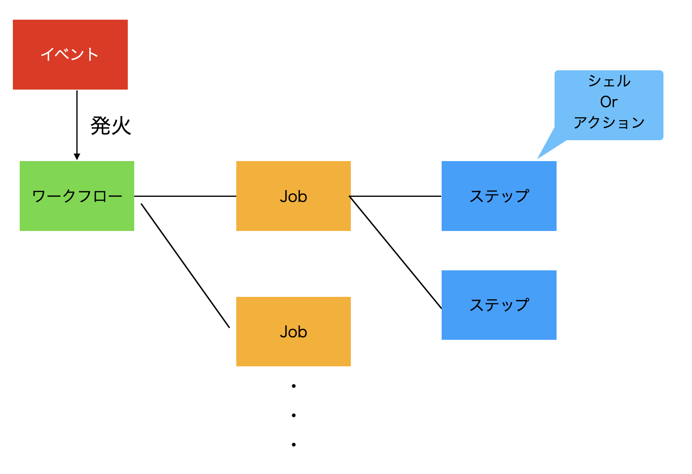

明けましておめでとうございます。
今年は、社会人4年目ですが、「技術力 × PM」として、飛躍したいですね。

なんだかんだ、GitHub Actionに触れたことがなかったので、今日はその辺を触れていこうと思います。
実は、この記事はGitHub Actionで自動投稿しています・・・！！

この記事で触れる成果物は[ここ](https://github.com/mitsumizo/practice_github_action/blob/develop/.github/workflows/develop_artifact_make.yml)にあります。

下記ができるようになるのが目標である。
:::mermaid
graph TD;
    A(チェックアウト)-->B(仮想環境にPythonのセットアップ)
    B-->C(Pythonの仮想環境を作成)
    C-->D(ライブラリをインストール)
    D-->E(リリース用のZip化)
:::

## この記事の流れ

1. GitHub Actionの概念に少し触れる
2. 成果物の説明を少し
という流れで進んでいきます。

## GitHub Actionの概念

下記が各概念の関連図である。



### そもそもGitHub Actionって？

GitHub ActionはGitHub社が提供しているCI/CDプラットフォームである。ビルド、テスト、デプロイなどのワークフロー（手順）を明記して、
各メンバーのGitHub操作によってそれぞれを実行できる状態にする。これによって、工数削減になるだけではなく、人的ミスも避けることができるので導入は必須である。
※ ユーザ企業や、レガシー企業は導入されていないことも多い・・・・？

### イベント

イベントはGitHub上の一つ一つの操作のことを示す。
例えば、push, Pull Request, Issueの作成など様々ある。
後述するワークフローを発生させる「トリガー」を意味する。

全量は「[ここ](https://docs.github.com/ja/actions/using-workflows/events-that-trigger-workflows#about-events-that-trigger-workflows)」に明記されているので確認したい。(覚える必要なんてなくて、ふーんって思う程度に)

### ワークフロー

先ほどのイベントが発生した時に発火するお仕事の塊である。
お仕事についての説明は、次の[job](#job)に委譲するが、ここでは、ワークフローの定義の仕方について説明する。

ワークフローは各リポジトリに「.github/workflows」フォルダを作成し、その下でymlファイルで明記する。(.githubフォルダは隠しフォルダである。)
vsCodeの[GitHub Actionの拡張](https://marketplace.visualstudio.com/items?itemName=GitHub.vscode-github-actions)を入れると、ymlファイルがワークフローとして認識されるので注目したい。(アイコンが変わったり、github Actionの画面で実行できたりします。)

ymlファイルには、下記の項目を書く。
| 項目 | 意味                                                                                               | 必須 |
| ---- | -------------------------------------------------------------------------------------------------- | ---- |
| name | ワークフローの名前を定義する。ない場合は、ファイル名になる。GitHubのActionに表示されることになる。 | ×    |
| on   | このワークフローのイベントを定義する。                                                             | ○    |
| jobs | このワークフローの仕事を定義する。仕事の内容は次に委譲する。                                       | ○    |


### Job

Jobは次で説明するステップの集合体である。また、実はJobは同じ環境で実行されるお仕事の集合体でもある。
GitHub Actionは「Ubuntu / Windows / Mac OS」のそれぞれの仮想環境を提供している。つまり、実行するとそれぞれの仮想環境が作成される。
この仮想環境上でこの後のステップを一つ一つ行なっていく。
改めてであるが、Jobの役割は「同じ環境で実行されるお仕事をグルーピングすること」であり、ymlファイルでは「jobs」で定義する。

### ステップ

ステップとは、Jobの中で定義されるお仕事の一つ一つのことを示している。お仕事とは「シェル」か「アクション」で定義される。

#### シェル

```bash
cd hogehoge
pip install openai
```

など、シェル上で操作できるコマンドは全てステップの一つとみなされる。

#### アクション

アクションは、特定のユースケースをまとめたステップ群だと思ってもらえれば良い。git checkoutやpythonのセットアップなどそれぞれのシェルコマンドを明記しても良いが、一連の流れは同じケースになりやすいのでまとめたものである。
例えば、pythonをセットアップするのは「actions/python-setup」と書けば、github actionは仮想環境上でpythonの環境をセットアップしてくれることになる。pythonをセットアップするためには、一連の流れがあるがユーザはそれを気にせずに環境を作ることができるのだ。

アクションは自分で作成できるが、「GitHub Marketplace」で偉人が作成したものを使えるので参考にしたい。偉人の方々、ありがとう！！！

## 成果物の説明を少し

Jobの流れは下記のようになっている。

:::mermaid
graph TD;
    A(チェックアウト)-->B(仮想環境にPythonのセットアップ)
    B-->C(Pythonの仮想環境を作成)
    C-->D(ライブラリをインストール)
    D-->E(リリース用のZip化)
:::

### Jobの前の記述

Jobsの前に下記のような記載がある。

```yml
name : Build Artifact

on:
  push:
    branches:
      - develop
```

上記は二つのことを定義している。

1. GitHubのActionタブの箇所には「Build Artifact」と明記されること。
2. developというブランチに「push」されると、これから書くJobが実行されること。

ちなみに・・・・
リポジトリの、「settings > General > Default branch」でデフォルトのブランチが変えられる。
いつもmainになっていて、PR出す時にめんどくさいなと思っていたので、ここを変えると良い。
知らなかったのが恥ずかしい・・・・

### Jobの記述

これからJobの中身を見ていく。本当にそんなに難しくないことが私の発見である。
ここまで簡易的に書けるようになった、GitHub社の努力には頭が上がらない。

#### チェックアウト

下記だけである。

```yml
steps:
    - uses : actions/checkout@v4.1.1
```

Actionを実行する際は「uses」で定義する。
このActionの[詳細](https://github.com/actions/checkout)にあるが、やりたいことは「GitHubがこのプロジェクトにアクセスできるようにする」
ことである。プロジェクトを操作(ビルド、テスト・・・)する場合は、必須であると思う。

#### 仮想環境にPythonのセットアップ

```yml
- name: Set up Python version
  uses : actions/setup-python@main
  with:
    python-version : '3.12'
```

上記を使えば、Python3.12の環境が出来る。バージョンはそれぞれの環境に合わせること。
これを実行することで、下記がセットアップされる。

- PythonまたはPyPyのバージョンをインストールし、（デフォルトで）PATHに追加する。
- オプションでpip、pipenv、pythonの依存関係をキャッシュします。
- エラー出力用の問題マッチャーの登録

詳細は[こちら](https://github.com/actions/setup-python?tab=readme-ov-file)に明記してある。


#### Pythonの仮想環境を作成 & ライブラリをインストール

```yml
- name : Create and start virtual enviroment
  run : |
    python -m venv venv
    source venv/bin/activate
- name : Install dependencies
  run : pip install .
```

上記はActionではなく「シェル」の利用の例である。
詳しく説明する必要はないが、今回は「」を使っているので「pip install .」を実行し、pyproject.tomlに明記してある依存ライブラリをインストールする。シェルをワンラインで書く場合は「|」を使ってパイプするとできる。

#### リリース用のZip化

```yml
- name : Zip artifact for deployment
  run : zip release.zip ./* -r

- name : Upload artifact for deployment jobs
  uses : actions/upload-artifact@v4.0.0
  with:
    name : python-app
    path : |
    release.zip
    !venv/
```

上記で、作成したプロジェクトをZip化する。本当はこのZip化したプロジェクトをAzure Web Appsみたいな所にデプロイするのであろうがここでは、Zip化までで止める。(わからないわけではなく、クラウドを準備するのが大変なだけだもん・・・)

最初に、zipコマンド(シェル)で再帰的にプロジェクトをzip化にする。
その後、python-appとして、GitHub上にアップロードする。これによって、このZipファイルをGitHub上でダウンロード出来るので、そのファイルをそのままデプロイできる！！きっと、デプロイまでGitHub Actionにやらせるのは難しい企業も多いはず・・・？

ここで[詳細](https://github.com/actions/upload-artifact)が見れるので確認したい。

## 最後に

CI/CDは難しいと勝手に思い込んでいたが、2,3時間でここまで来れた。
一度勉強したことで、今後は、あらゆる操作をワークフロー化出来るのではないかと漲った。
正直概要はここまでで良い。あとは、実務で作りまくるだけである。

以上！

## 参考

書いておいてなんだが、公式ドキュメントが一番わかりやすい。
[GitHub Actionの公式ドキュメント](https://docs.github.com/ja/actions/learn-github-actions/understanding-github-actions)
